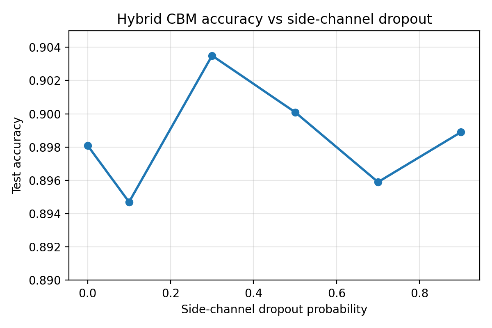

# Concept Bottleneck Models on Fashion-MNIST

## 1. Introduction

This project studies concept bottleneck modeling on Fashion-MNIST, with the goal of comparing predictive performance, interpretability, and steerability. The repository implements four components: a baseline CNN classifier mapping images directly to labels (`x -> y`), a concept predictor mapping images to binary concepts (`x -> c`), a concept bottleneck model (CBM) mapping `x -> c -> y`, and a hybrid CBM combining a concept pathway with a direct side channel, `y = f(c) + s(x)`.

The central motivation is that concept-based models expose an interpretable intermediate representation that can be inspected and manipulated. This can improve transparency and enable concept-level interventions, but it may also constrain raw predictive performance if the concept set is incomplete. In this project, Fashion-MNIST provides a simple benchmark for testing that trade-off.

## 2. Experimental Setup

The dataset is Fashion-MNIST from `torchvision`, consisting of `28 x 28` grayscale images across 10 clothing categories: T-shirt/top, Trouser, Pullover, Dress, Coat, Sandal, Shirt, Sneaker, Bag, and Ankle boot. The notebook uses a simple `ToTensor()` transform and standard train/test splits.

Concept labels are generated deterministically from the class label rather than annotated independently. The implemented concept set is:

| Index | Concept |
|---|---|
| `c0` | is footwear |
| `c1` | is closed footwear |
| `c2` | is footwear or bag |
| `c3` | has sleeves |
| `c4` | has collar |
| `c5` | is long garment |
| `c6` | is outerwear layer |
| `c7` | is legwear or footwear |

This design makes concept supervision clean and reproducible, but it also limits semantic richness. Several Fashion-MNIST distinctions still require combining multiple coarse binary attributes rather than relying on a richer semantic description. That limitation matters when interpreting the CBM results.

All models share the same CNN backbone: two convolutional blocks with ReLU activations and max pooling, followed by a fully connected layer producing a 128-dimensional hidden representation. The baseline and concept predictor are trained for 5 epochs. The hybrid models are trained for 3 epochs per dropout setting. Evaluation uses test accuracy and one-vs-rest multiclass AUROC for label prediction, and per-concept plus macro F1 for concept prediction.

## 3. Models

The baseline classifier is a straightforward CNN with a single linear head from the 128-dimensional representation to 10 class logits. It serves as the accuracy-oriented reference model with no explicit interpretability mechanism.

The concept predictor uses the same backbone but replaces the label head with an 8-dimensional sigmoid output layer. Because the concepts are binary and not mutually exclusive, it is trained with binary cross-entropy.

The CBM is implemented as an **independent** bottleneck model rather than a jointly optimized one. First, the concept model is trained. Then its outputs are used as frozen concept features, and a linear classifier is trained on top of them to predict the class label. This design maximizes transparency because the label head can only use the concept vector, but it also makes performance strongly dependent on whether the concept set is sufficient for the task.

The hybrid CBM combines a concept path and a direct image-to-label side channel. Given hidden representation `h`, the model predicts concepts `c = sigmoid(W_c h)`, computes concept-based logits `y_c = W_y c`, and adds a side-channel prediction `y_s = W_s dropout(h)`. The final output is `y = y_c + y_s`. In the implementation, the hybrid is trained jointly using the sum of cross-entropy for labels and binary cross-entropy for concepts.

## 4. Results

Table 1 summarizes the main predictive metrics available in the notebook outputs.

| Model | Accuracy | AUROC | Notes |
|---|---:|---:|---|
| Baseline CNN | 0.9080 | 0.9938 | Direct `x -> y` classifier |
| Concept predictor (`x -> c`) | Not applicable | Not applicable | Evaluated using F1 for multi-label concepts |
| CBM (`x -> c -> y`) | 0.8109 | 0.9824 | Independently trained bottleneck |
| Hybrid CBM, `p=0.0` | 0.8981 | 0.9931 | Joint concept plus side-channel model |
| Hybrid CBM, `p=0.1` | 0.8947 | 0.9926 | Joint concept plus side-channel model |
| Hybrid CBM, `p=0.3` | 0.9035 | 0.9931 | Highest hybrid accuracy in this rerun |
| Hybrid CBM, `p=0.5` | 0.9001 | 0.9926 | Joint concept plus side-channel model |
| Hybrid CBM, `p=0.7` | 0.8959 | 0.9927 | Joint concept plus side-channel model |
| Hybrid CBM, `p=0.9` | 0.8989 | 0.9917 | Final hybrid model in notebook flow |

The baseline still achieves the strongest overall classification performance. The independent CBM shows a clear drop to `0.8109` accuracy and `0.9824` AUROC, which confirms a meaningful interpretability-performance trade-off even with a fairly informative concept set. The hybrid models recover most of that lost performance: all six tested dropout settings stay near `0.895` to `0.904` accuracy and around `0.992` to `0.993` AUROC, substantially outperforming the pure CBM while remaining slightly below the unconstrained baseline.

The quantitative comparison is clear. Relative to the baseline accuracy of `0.9080`, the independent CBM is lower by `0.0971`, whereas the best hybrid model (`p=0.3`) is lower by only `0.0045`. Put differently, the hybrid recovers `0.0926` of the `0.0971` accuracy lost by the strict bottleneck, while also improving AUROC from `0.9824` in the CBM to `0.9931` at its best.

Concept prediction quality is summarized in Table 2.

| Concept | Concept model F1 | Hybrid model F1 (`p=0.9`) |
|---|---:|---:|
| Is footwear | 0.9990 | 0.9987 |
| Is closed footwear | 0.9905 | 0.9883 |
| Is footwear or bag | 0.9969 | 0.9961 |
| Has sleeves | 0.9947 | 0.9929 |
| Has collar | 0.8404 | 0.8237 |
| Is long garment | 0.8857 | 0.8647 |
| Is outerwear layer | 0.9074 | 0.8859 |
| Is legwear or footwear | 0.9955 | 0.9946 |
| **Macro F1** | **0.9513** | **0.9431** |

These values show that the learned concepts are highly recoverable from the images, although not uniformly so. The strongest concepts are nearly perfect, while `has collar`, `is long garment`, and `is outerwear layer` remain materially harder. The final hybrid instance in the notebook (now the `p=0.9` model, because it is the last trained model in the sweep) preserves strong concept prediction with only a modest drop from the standalone concept predictor. That is encouraging from an interpretability perspective, but it also reveals a key limitation of this benchmark setup: high concept F1 alone is not enough to eliminate the remaining gap to the baseline classifier.

Figure 1 shows test accuracy as a function of side-channel dropout probability.

For the side-channel dropout experiment, the rerun now covers the full six-setting sweep implemented in the notebook. Accuracy peaks at `0.9035` for `p=0.3`, while `p=0.0`, `0.5`, and `0.9` remain close behind and `p=0.1` and `0.7` are slightly weaker. AUROC is also fairly stable, with the best value `0.9931` appearing at both `p=0.0` and `p=0.3`, and the lowest value `0.9917` appearing at `p=0.9`. The overall curve is therefore still fairly flat: increasing side-channel dropout changes performance, but not dramatically, and there is no simple monotonic trend.

## 5. Steerability and Concept Interventions

The repository includes a concept intervention experiment on the final hybrid model instance. For each test batch, one concept is flipped while the downstream concept-based predictor is recomputed. Two quantities are reported: average absolute probability change and label flip rate.

| Concept | Avg. probability change | Flip rate |
|---|---:|---:|
| Is footwear | 0.1314 | 0.4746 |
| Is closed footwear | 0.1337 | 0.7975 |
| Is footwear or bag | 0.1339 | 0.4704 |
| Has sleeves | 0.1368 | 0.3901 |
| Has collar | 0.1368 | 0.6767 |
| Is long garment | 0.1421 | 0.7837 |
| Is outerwear layer | 0.1335 | 0.5614 |
| Is legwear or footwear | 0.1334 | 0.5395 |

The resulting importance ranking by average probability change is: `is long garment`, `has collar`, `has sleeves`, `is footwear or bag`, `is closed footwear`, `is outerwear layer`, `is legwear or footwear`, and `is footwear`. All eight tested concepts produce substantial changes in predicted probabilities, and several produce high label-flip rates. This indicates that the concept pathway is meaningfully steerable: modifying concepts materially changes the model output. Relative to the baseline classifier, which has no explicit concept interface for such interventions, the hybrid CBM is more steerable because changing concept values produces strong and consistent downstream effects.

At the same time, these intervention results should be interpreted carefully. The experiment is conducted only on the last hybrid model stored in the notebook, not across all dropout settings, and it flips concepts synthetically rather than correcting them toward verified ground-truth counterfactuals. The results therefore demonstrate sensitivity to concept manipulation, but not necessarily robust or semantically calibrated steering.

## 6. Discussion

The most important pattern in the repository is still the trade-off between interpretability and raw performance, but the rerun makes the hybrid story much clearer than the earlier draft did. The baseline CNN remains the strongest classifier at `0.9080` accuracy, while the independent CBM drops to `0.8109`. Given the generally high concept F1 scores, the remaining CBM gap is best explained by partial concept insufficiency rather than optimization failure. The 8 implemented concepts capture a large amount of useful structure, but they still do not fully reconstruct the ten-way label decision.

The hybrid architecture is the most promising design in practice as well as in principle because it combines concept supervision with a residual image signal. In this rerun, every tested hybrid variant improves dramatically over the pure CBM and lands within roughly half to one and a half percentage points of the baseline accuracy. That makes the hybrid model the clearest compromise in the repository: it retains explicit concepts while recovering most of the predictive performance lost by the strict bottleneck.

The dropout study is similarly suggestive but still incomplete in its analysis. Side-channel dropout is intended to force the hybrid model to rely less on the direct image shortcut and more on the concept bottleneck. In the implemented six-setting sweep, performance is quite stable, with the best accuracy at `p=0.3` and only modest degradation at the highest dropout setting `p=0.9`. That stability suggests the side channel is helpful but not overwhelmingly dominant under the current loss and architecture. The experiment is more complete than before, but it still lacks deeper analysis of how these settings change concept reliance beyond top-line metrics.

There are several limitations. First, although the concept set is larger than the stale report claimed, it is still hand-coded and fairly coarse for the task. Second, the repository does not separate notebook code into reusable training and evaluation scripts, which makes experiments harder to reproduce. Third, the notebook still does not print or save the hybrid metrics directly as persistent artifacts. Fourth, the intervention analysis is narrow and does not compare models or dropout levels systematically. Fifth, the interventions are still synthetic flips rather than verified semantic counterfactual edits.

Possible improvements are straightforward: print and save hybrid metrics for every dropout level; export plots as files; compare interventions across dropout levels rather than only on the final model; and compare independent and joint CBMs directly. Those changes would make the report substantially stronger.

## 7. Conclusion

This project demonstrates the main promise and tension of concept bottleneck modeling on Fashion-MNIST. The baseline CNN achieves the best predictive performance, while the independent CBM offers strong interpretability and intervention access with substantially weaker label accuracy. The concept predictors themselves perform well, showing that useful semantic structure can be extracted reliably from the images.

The hybrid CBM and side-channel dropout experiments now provide concrete evidence for a more balanced solution. Across the six implemented dropout settings, the hybrid model maintains about `0.895` to `0.904` accuracy and about `0.992` to `0.993` AUROC while preserving strong concept F1 and meaningful intervention sensitivity across all 8 concepts. The main conclusion is therefore more specific than before: concept-based supervision clearly improves transparency and steerability, and in this implementation the hybrid design preserves most of the baseline predictive power, though the dropout study still lacks deeper analysis beyond the aggregate metrics.

## Limitations

- The concept predictor remains an `x -> c` model only, so standalone label accuracy and AUROC are not meaningful summary metrics for that row in Table 1.
- The reported hybrid metrics and intervention summaries are still tied mainly to the notebook workflow in `project1.ipynb` rather than a separate artifact pipeline.
- The intervention analysis demonstrates sensitivity to concept changes, but it is limited to synthetic concept flips on one stored hybrid instance rather than verified semantic counterfactuals across models.
